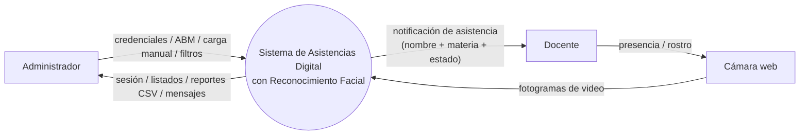
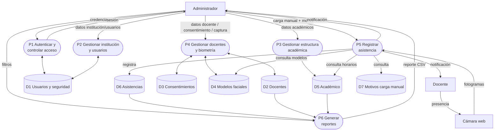
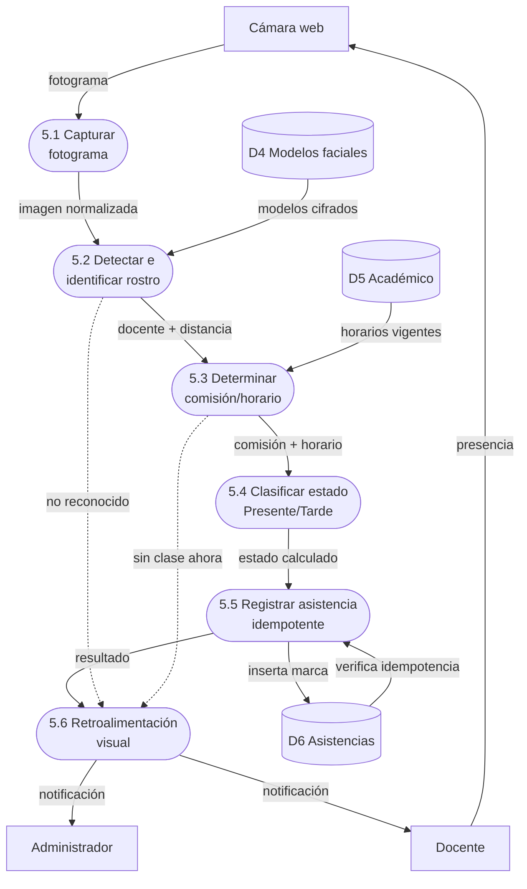

# 03 — Diagramas de Flujo de Datos (DFD)

| | |
|---|---|
| **Proyecto** | Sistema de Asistencias Digital con Reconocimiento Facial |
| **Documento** | 03 — Diagramas de Flujo de Datos (Niveles 0, 1 y 2) |
| **Materia** | Prácticas Profesionalizantes III — CENT35 |
| **Ubicación** | Provincia de Tierra del Fuego, Argentina |
| **Autor** | Francisco Quiroga |
| **Versión** | 1.0 |
| **Fecha** | Junio 2026 |

---

## 1. Introducción

Los Diagramas de Flujo de Datos (DFD) representan cómo la información entra,
se procesa y sale del sistema, en niveles de detalle crecientes:

- **Nivel 0 (Contexto):** el sistema como una sola "caja negra" con sus
  actores externos y los datos que entran/salen.
- **Nivel 1 (Procesos):** se "abre la caja" y se muestran los procesos o
  módulos principales conectados entre sí, con los actores y los almacenes
  de datos.
- **Nivel 2 (Explosión):** se toma un proceso del Nivel 1 y se detalla su
  paso a paso interno. Se explota el proceso principal del sistema:
  *Registrar asistencia automática*.

**Notación (Gane-Sarson):**
- **Entidad externa** (quién interactúa desde afuera): rectángulo.
- **Proceso** (qué hace el sistema): rectángulo redondeado, numerado.
- **Almacén de datos** (dónde se guarda): cilindro `D1…Dn`.
- **Flujo de datos**: flecha etiquetada con el dato que viaja.

> Los diagramas están expresados en código Mermaid (se renderizan en
> GitHub, en [mermaid.live](https://mermaid.live) o se importan a
> [draw.io](https://app.diagrams.net) vía *Extras → Insertar → Mermaid*).
> Cada nivel incluye una tabla de especificación para reconstruirlo a mano.
>
> **Nota de alcance:** el módulo de Auditoría existe en el modelo de datos
> pero su escritura no está implementada en el hito 1 (ver documento 02),
> por lo que no figura como proceso en estos DFD.

---

## 2. Nivel 0 — Diagrama de Contexto ("la caja negra")

El sistema entero como un solo proceso. Solo se ven los actores externos y
qué entra / qué sale; sin procesos internos ni almacenes.

### 2.1. Especificación

**Entidades externas:**
| Cód | Entidad | Rol |
|---|---|---|
| EE1 | Administrador | Roles INSTITUCION / ADMIN. Opera el sistema. |
| EE2 | Docente | Sujeto pasivo: se posiciona frente a la cámara. |
| EE3 | Cámara web | Dispositivo que capta los fotogramas. |

**Flujos de entrada (hacia el sistema):**
| Origen | Dato que entra |
|---|---|
| Administrador | Credenciales de acceso |
| Administrador | Datos de gestión (ABM docentes, académico, usuarios) |
| Administrador | Consentimiento biométrico (carga en representación) |
| Administrador | Datos de carga manual / justificación de ausencia |
| Administrador | Filtros de reporte |
| Cámara web | Fotogramas de video |
| Docente | Presencia / rostro (a través de la cámara) |

**Flujos de salida (desde el sistema):**
| Destino | Dato que sale |
|---|---|
| Administrador | Confirmación de sesión y panel de inicio |
| Administrador | Listados, fichas y mensajes de resultado |
| Administrador | Reportes (CSV) |
| Administrador / Docente | Notificación de asistencia (nombre + materia + estado) |

### 2.2. Diagrama

---

## 3. Nivel 1 — Procesos principales ("abro la caja")

Los grandes módulos del sistema conectados entre sí, con los actores y con
los almacenes de datos. Todavía sin el detalle interno de cada proceso.

### 3.1. Especificación

**Procesos:**
| Cód | Proceso |
|---|---|
| P1 | Autenticar y controlar acceso |
| P2 | Gestionar institución y usuarios |
| P3 | Gestionar estructura académica (carreras, materias, comisiones, horarios) |
| P4 | Gestionar docentes y biometría (consentimiento + modelo facial) |
| P5 | Registrar asistencia (automática y manual) |
| P6 | Generar reportes |

**Almacenes de datos:**
| Cód | Almacén | Tablas que agrupa |
|---|---|---|
| D1 | Usuarios y seguridad | instituciones, usuarios, roles |
| D2 | Docentes | docentes |
| D3 | Consentimientos | consentimientos_biometricos |
| D4 | Modelos faciales | modelos_faciales |
| D5 | Académico | carreras, materias, comisiones, horarios |
| D6 | Asistencias | asistencias, asistencias_manuales, justificaciones_ausencia |
| D7 | Motivos de carga manual | motivos_carga_manual |

**Flujos principales:**
| Desde | Hacia | Dato |
|---|---|---|
| Administrador | P1 | credenciales |
| P1 | D1 | valida usuario |
| P1 | Administrador | sesión / acceso |
| Administrador | P2 | datos de institución y usuarios |
| P2 | D1 | lee / escribe |
| Administrador | P3 | datos académicos |
| P3 | D5 | lee / escribe |
| Administrador | P4 | datos docente + consentimiento + captura facial |
| P4 | D2 / D3 / D4 | lee / escribe |
| Cámara web | P5 | fotogramas |
| P5 | D4 | consulta modelos (identificar) |
| P5 | D5 | consulta horarios (determinar comisión) |
| P5 | D6 | registra asistencia |
| Administrador | P5 | carga manual + motivo |
| P5 | D7 | consulta motivos |
| P5 | Administrador / Docente | notificación de asistencia |
| Administrador | P6 | filtros de reporte |
| P6 | D6 / D2 / D5 | consulta datos |
| P6 | Administrador | reporte CSV |

### 3.2. Diagrama

---

## 4. Nivel 2 — Explosión de P5 "Registrar asistencia automática"

Paso a paso interno del proceso P5 (camino automático por reconocimiento
facial). Es el flujo principal del sistema (RF-15 a RF-21).

### 4.1. Especificación

**Subprocesos:**
| Cód | Subproceso |
|---|---|
| 5.1 | Capturar fotograma de la cámara |
| 5.2 | Detectar e identificar rostro |
| 5.3 | Determinar comisión / horario vigente |
| 5.4 | Clasificar estado (Presente / Tarde) |
| 5.5 | Registrar asistencia (idempotente) |
| 5.6 | Generar retroalimentación visual |

**Flujo principal:**
| Desde | Hacia | Dato |
|---|---|---|
| Cámara web | 5.1 | fotograma crudo |
| 5.1 | 5.2 | imagen normalizada |
| D4 Modelos faciales | 5.2 | modelos cifrados para comparar |
| 5.2 | 5.3 | docente identificado (+ distancia) |
| D5 Académico | 5.3 | horarios vigentes del docente |
| 5.3 | 5.4 | comisión + horario en curso |
| 5.4 | 5.5 | estado calculado (PRESENTE / TARDE) |
| 5.5 | D6 Asistencias | inserta marca (si no existe) |
| D6 Asistencias | 5.5 | verificación de idempotencia |
| 5.5 | 5.6 | resultado del registro |
| 5.6 | Administrador / Docente | notificación en pantalla |

**Flujos alternativos / excepciones:**
| Condición | Resultado |
|---|---|
| 5.2 no identifica rostro bajo el umbral | 5.6 muestra "Rostro no reconocido" (habilita carga manual) |
| 5.3 no encuentra horario en curso | 5.6 muestra "No hay clase en este momento" |
| 5.5 detecta marca ya existente | 5.6 muestra "Ya estaba marcado" (no duplica) |

### 4.2. Diagrama

---

## 5. Cómo exportar a imagen para la entrega

1. **GitHub**: renderiza el Mermaid automáticamente al ver este `.md`.
2. **mermaid.live**: pegar cada bloque → Actions → PNG / SVG.
3. **draw.io**: `Extras → Insertar → Mermaid…` → pegar el bloque → reacomodar
   → Exportar como PNG / PDF.
