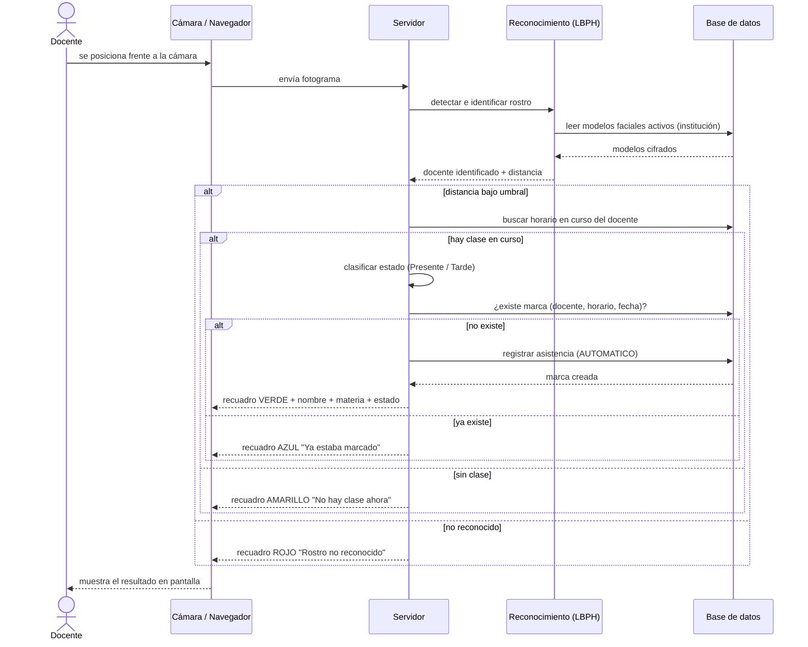

# 06 — Caso de Uso: Registro de Asistencia Automática

| | |
|---|---|
| **Proyecto** | Sistema de Asistencias Digital con Reconocimiento Facial |
| **Documento** | 06 — Caso de Uso: Registro de Asistencia Automática |
| **Materia** | Prácticas Profesionalizantes III — CENT35 |
| **Ubicación** | Provincia de Tierra del Fuego, Argentina |
| **Autor** | Francisco Quiroga |
| **Versión** | 1.0 |
| **Fecha** | Junio 2026 |

---

## 1. Introducción

Este documento desarrolla en detalle el **caso de uso principal** del sistema:
el registro de asistencia de un docente mediante reconocimiento facial
automático. Es el flujo que da sentido al proyecto y agrupa los
requerimientos RF-15 a RF-21. Se complementa con el **DFD Nivel 2**
(documento 03, sección 4) y con el diagrama de secuencia del final.

---

## 2. Especificación del caso de uso

| Campo | Detalle |
|---|---|
| **ID** | CU-10 |
| **Nombre** | Registrar asistencia automática |
| **Actor principal** | Docente (sujeto pasivo) |
| **Actores secundarios** | Sistema de Reconocimiento (OpenCV/LBPH); Administrador (supervisa el punto de captura) |
| **Requerimientos asociados** | RF-15, RF-16, RF-17, RF-18, RF-19, RF-20, RF-21 |
| **Descripción** | El sistema detecta a un docente frente a la cámara, lo identifica contra su modelo biométrico, determina la clase en curso y registra automáticamente su asistencia con el estado correspondiente, sin intervención manual. |
| **Frecuencia de uso** | Alta (varias veces por día, al inicio de cada clase). |

### Precondiciones
1. El docente tiene un **consentimiento biométrico vigente** (RF-10).
2. El docente tiene un **modelo facial activo** registrado (RF-08).
3. El docente está **asignado a una comisión** que tiene un horario cargado.
4. La pantalla de **Pase de asistencia** está activa con la cámara encendida.
5. El instante actual cae dentro de la **ventana del horario**
   (`[hora_inicio − tolerancia, hora_fin]`).

### Postcondiciones
- **Éxito**: se registra una asistencia con estado `PRESENTE` o `TARDE`,
  método `AUTOMATICO`, hora exacta, modelo facial usado y nivel de confianza.
  Se muestra confirmación visual.
- **Fracaso**: no se registra ninguna marca; el sistema informa el motivo
  (no reconocido / sin clase / ya marcado).

### Flujo principal (camino feliz)
1. El docente se posiciona frente a la cámara web.
2. El navegador captura fotogramas y los envía al servidor (RF-15).
3. El servidor detecta el rostro en la imagen (RF-16).
4. El servidor compara el rostro contra los **modelos faciales activos de la
   institución** (RF-16).
5. El servidor **identifica al docente**: la distancia obtenida está por
   debajo del umbral de confianza definido.
6. El servidor **determina la comisión y el horario en curso**, cruzando la
   hora actual con los horarios del docente (RF-18).
7. El servidor **clasifica el estado**: `PRESENTE` si la marca ocurre dentro
   de la tolerancia previa al inicio; `TARDE` si ocurre pasado el horario de
   inicio (RF-19).
8. El servidor verifica que **no exista una marca previa** para ese docente,
   horario y fecha (idempotencia).
9. El servidor **registra la asistencia** con todos los metadatos: fecha,
   hora exacta, docente, comisión, estado, método AUTOMATICO, modelo facial y
   confianza (RF-17, RF-21).
10. El sistema muestra una **notificación visual**: recuadro verde sobre el
    rostro con el nombre del docente, la materia/comisión y el estado (RF-20).

### Flujos alternativos
- **5a. Rostro no reconocido** (distancia mayor al umbral, o docente sin
  modelo registrado): el sistema muestra un recuadro **rojo** con "Rostro no
  reconocido". No se registra asistencia. El administrador puede recurrir a la
  **carga manual** (CU-11).
- **6a. No hay clase en curso** (ningún horario del docente cae en la
  ventana actual): el sistema muestra un recuadro **amarillo** con "No hay
  clase en este momento". No se registra asistencia.
- **8a. Asistencia ya registrada** (ya existe marca para ese docente, horario
  y fecha): el sistema muestra un recuadro **azul** con "Ya estaba marcado".
  No se duplica el registro.

### Excepciones
- **E1. Cámara no disponible**: si el navegador no obtiene acceso a la cámara
  (permiso denegado, dispositivo ocupado), el sistema muestra un mensaje
  claro y no inicia el pase.
- **E2. Error de comunicación con el servidor**: si un fotograma no llega a
  procesarse, el sistema lo ignora y continúa con el siguiente, sin afectar
  la sesión.

### Reglas de negocio
- **RN1**: el reconocimiento requiere consentimiento biométrico vigente; sin
  consentimiento no existe modelo facial que comparar.
- **RN2 (idempotencia)**: una sola marca por combinación
  (docente, horario, fecha). Aunque el docente permanezca frente a la cámara,
  no se generan marcas duplicadas.
- **RN3 (clasificación)**: `PRESENTE` hasta el horario de inicio (con
  tolerancia previa configurable por horario); `TARDE` una vez superado el
  horario de inicio.
- **RN4 (AUSENTE)**: el estado `AUSENTE` no se registra por este flujo; se
  calcula al listar las asistencias del día para los horarios sin marca.
- **RN5 (privacidad)**: no se almacenan las imágenes captadas; solo se utiliza
  el modelo biométrico cifrado (Ley 25.326).
- **RN6 (aislamiento multi-tenant)**: el rostro se compara únicamente contra
  los modelos de la institución correspondiente.

---

## 3. Diagrama de secuencia (resumen)

---

## 4. Trazabilidad

| Paso del caso de uso | Requerimiento | Componente del sistema |
|---|---|---|
| Captura de fotogramas | RF-15 | Navegador (getUserMedia) |
| Detección e identificación | RF-16 | Servicio de reconocimiento (OpenCV/LBPH) |
| Registro automático | RF-17 | Servicio de asistencia |
| Determinación de comisión/horario | RF-18 | Consulta de horarios |
| Clasificación del estado | RF-19 | Lógica de tolerancia |
| Retroalimentación visual | RF-20 | Interfaz del pase de asistencia |
| Registro de metadatos | RF-21 | Persistencia de la asistencia |

> El detalle del flujo de datos interno de este caso de uso está en el
> **DFD Nivel 2** (documento 03, sección 4).
