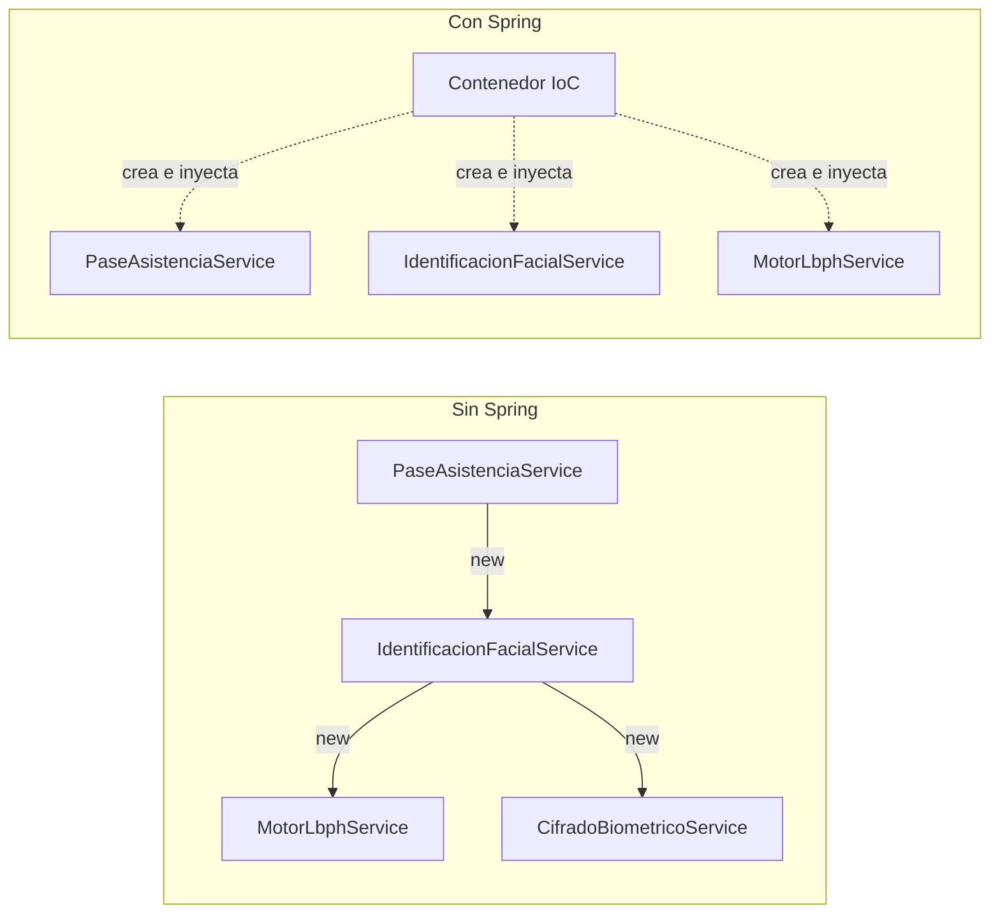
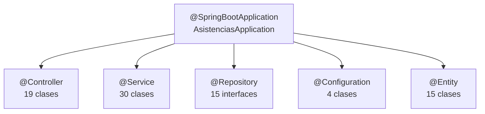
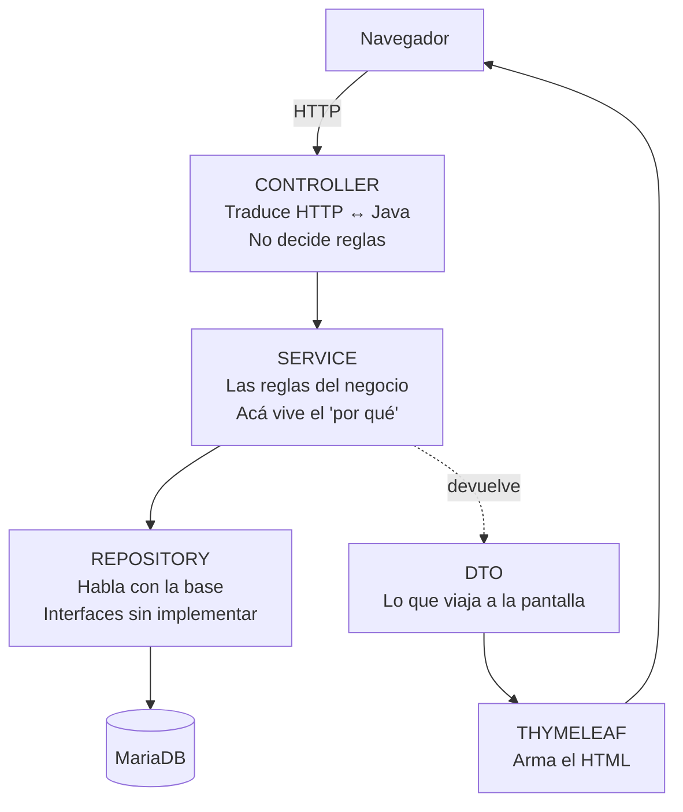
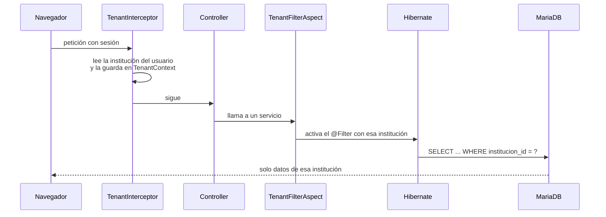
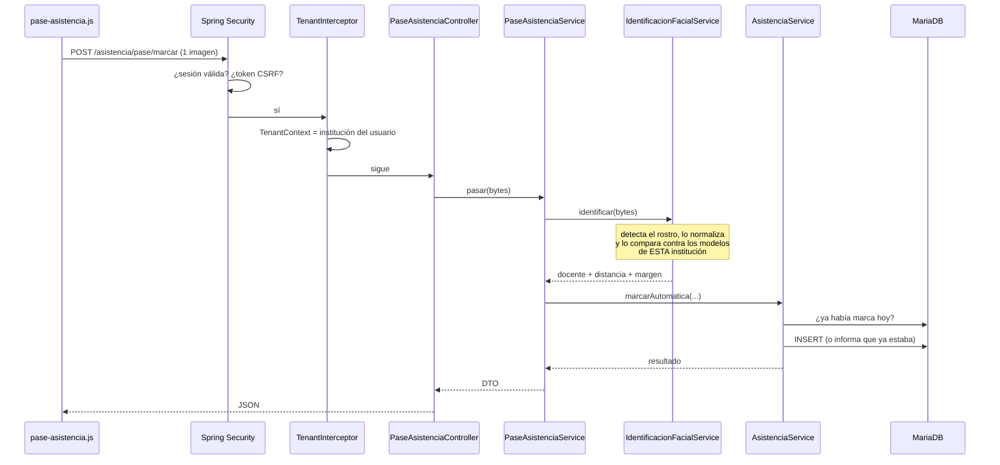

# Spring Boot en este proyecto

> Para qué sirve este documento: entender qué hace Spring Boot por vos, dónde está
> aplicado en este código, y poder responder por qué está armado así. Está pensado
> para leerse de corrido antes de una defensa.

---

## 1. La idea en una frase

**Vos escribís las clases; Spring las crea, las conecta entre sí y las expone por HTTP.**

En un programa Java común, si `PaseAsistenciaService` necesita un
`IdentificacionFacialService`, lo crea con `new`. El problema es que entonces también
tiene que saber qué necesita *ese* objeto para nacer, y así hacia abajo. Una cadena de
diez servicios se vuelve imposible de armar a mano y de probar por separado.

Spring da vuelta esa responsabilidad. A eso se le llama **Inversión de Control**: el
control de crear objetos se invierte, deja de estar en tu código y pasa a un contenedor.
Vos declarás qué necesitás, y el contenedor te lo entrega ya construido. Esa entrega es
la **Inyección de Dependencias**.



Un objeto administrado por Spring se llama **bean**. La regla es corta: si lo creaste
vos con `new`, no es un bean; si lo creó Spring, sí.

---

## 2. Cómo sabe Spring qué crear

Al arrancar, Spring **escanea el paquete de la clase principal y todo lo que cuelga
debajo**, buscando clases con ciertas anotaciones. Cada una que encuentra la instancia y
la guarda.

En este proyecto la clase principal es `AsistenciasApplication`, en
`edu.cent35.asistencias`, y todo el código está debajo de ese paquete. Eso no es casual:
es la estructura que la propia documentación de Spring Boot recomienda, justamente para
que el escaneo alcance tu código y no se meta con el de las librerías.



`@SpringBootApplication` es en realidad tres anotaciones en una:

| Incluye | Qué hace |
|---|---|
| `@ComponentScan` | Busca beans desde este paquete hacia abajo |
| `@EnableAutoConfiguration` | Configura solo lo que detecta en el classpath |
| `@Configuration` | Permite declarar beans propios acá mismo |

### La autoconfiguración, explicada con algo de este proyecto

En `build.gradle` hay una línea que dice `spring-boot-starter-web`. Con solo eso, al
arrancar Spring Boot encuentra Tomcat en el classpath y **levanta un servidor web en el
puerto 8080 sin que nadie se lo pida**. Lo mismo con `spring-boot-starter-thymeleaf`: al
verlo, configura el motor de plantillas y decide que un controlador que devuelve el texto
`"home"` significa "renderizá `templates/home.html`".

Esto es lo que se llama **convención sobre configuración**: en vez de un archivo XML de
200 líneas describiendo el servidor, Spring asume lo razonable y vos solo escribís lo que
se aparta de eso. Lo que se aparta vive en `application.properties`.

Los starters que usa este proyecto:

| Starter | Para qué |
|---|---|
| `web` | Servidor Tomcat + controladores HTTP |
| `thymeleaf` | Plantillas HTML del lado del servidor |
| `data-jpa` | Acceso a la base sin escribir SQL a mano |
| `security` | Login, roles, CSRF |
| `validation` | Validar formularios con anotaciones |
| `mail` | Envío de los códigos de verificación |
| `aop` | El aspecto que aplica el filtro multi-tenant |
| `actuator` | Endpoints de salud del sistema |
| `test` | JUnit, Mockito y MockMvc |

---

## 3. Las cuatro capas

El proyecto está organizado por **responsabilidad**, no por funcionalidad. Cada petición
atraviesa las mismas cuatro capas siempre.



### Qué va en cada una

**Controller** — recibe la petición, saca los parámetros, llama a un servicio y decide
qué pantalla mostrar. **No toma decisiones de negocio.** Si ves un `if` con una regla
del dominio en un controlador, está en el lugar equivocado.

```java
@GetMapping
public String pantalla(Authentication auth, Model model) {
    model.addAttribute("panel", panelInicioService.armar());  // pide, no decide
    return "home";                                            // nombre de la plantilla
}
```

**Service** — acá vive el conocimiento del problema. `AsistenciaService` sabe que una
marca antes del horario es *Presente* y después es *Tarde*. `IdentificacionFacialService`
sabe que no alcanza con estar bajo el umbral: hay que ganarle al segundo candidato por un
margen. **Es la capa que hay que saber defender**, porque es la única que no se podría
reemplazar por otra herramienta.

**Repository** — son **interfaces vacías**. Esto sorprende a cualquiera que lo vea por
primera vez:

```java
public interface DocenteRepository extends JpaRepository<Docente, Long> {
    Optional<Docente> findByDni(String dni);   // no hay cuerpo, y funciona
}
```

Spring Data lee el **nombre del método**, entiende que `findByDni` significa
`SELECT * FROM docentes WHERE dni = ?`, y genera la implementación en tiempo de
ejecución. Cuando la consulta es más compleja que lo que un nombre puede expresar, se
escribe a mano con `@Query`, como en `AsistenciaRepository.findParaReporte`.

**Model (entidades)** — clases anotadas con `@Entity`, donde cada una es una tabla.
`Horario` tiene el método `estaEnCurso(hora)` porque saber si una clase está corriendo es
conocimiento del horario, no de quien lo pregunta.

**DTO** — objetos que existen solo para viajar. `PanelInicioDto` no es una tabla: es la
forma que la pantalla de inicio necesita. Separarlos evita que la pantalla dependa de
cómo está armada la base.

---

## 4. La inyección, en el código real

Este proyecto **no usa `@Autowired` en ningún lado**. Usa constructor, que es la forma
recomendada, escrita con una anotación de Lombok:

```java
@Service
@RequiredArgsConstructor          // Lombok escribe el constructor con los final
public class PanelInicioService {

    private final HorarioRepository horarioRepository;      // Spring los inyecta
    private final AsistenciaRepository asistenciaRepository;
    private final DocenteRepository docenteRepository;
}
```

**Por qué constructor y no `@Autowired` sobre el campo:**

1. Los campos pueden ser `final`: una vez creado el objeto, nadie le cambia sus
   dependencias.
2. Si falta una dependencia, **la aplicación no arranca**, en vez de fallar con un
   `NullPointerException` la primera vez que alguien usa esa pantalla.
3. En los tests se puede construir la clase pasándole dobles de prueba, sin levantar
   Spring. Eso es exactamente lo que hacen los tests unitarios de este proyecto.

---

## 5. Lo que Spring aporta más allá de crear objetos

### Transacciones

`@Transactional` marca un método como una unidad: **o pasa todo, o no pasa nada**. En
`ModeloFacialService.registrar` se guarda el modelo nuevo y se da de baja el anterior; si
lo segundo falla, lo primero se deshace solo. Nadie escribe `commit` ni `rollback`.

El proyecto lo usa 79 veces, y las lecturas van marcadas `readOnly = true`, que le avisa
a Hibernate que no hace falta vigilar cambios.

### Seguridad

`SecurityConfig` declara qué rutas son públicas y cuáles no. Sobre eso,
`@PreAuthorize("hasRole('INSTITUCION')")` protege métodos concretos. Se usa 16 veces.

### Aspectos: el multi-tenant

Este es el punto más interesante de la arquitectura y conviene tenerlo claro.

El sistema es **multi-tenant**: varias instituciones comparten la misma base, y ninguna
puede ver los datos de otra. La forma ingenua sería agregar
`WHERE institucion_id = ?` en cada consulta — y con quince repositorios, alcanza con
olvidarse una vez para filtrar una fuga.

En vez de eso, hay **tres capas de defensa**:



1. **`TenantInterceptor`** publica la institución del usuario logueado en un
   `TenantContext` antes de que el pedido llegue al controlador.
2. **`TenantFilterAspect`** es un aspecto: código que se ejecuta *alrededor* de otro sin
   que ese otro se entere. Activa un filtro de Hibernate que agrega la condición a todas
   las consultas.
3. **Las consultas críticas reciben el `tenantId` explícito** como parámetro, por si
   alguna se escapara de las dos anteriores.

> **Si te preguntan por qué un aspecto y no repetir el `WHERE`:** porque un `WHERE`
> repetido quince veces es quince oportunidades de olvidarlo, y el costo de olvidarlo es
> que una institución vea los datos de otra. El aspecto lo aplica una sola vez, en un
> lugar, y no se puede olvidar.

### Tareas programadas

`@Scheduled` corre métodos solo, sin que nadie los invoque. Se usa 4 veces: la generación
de ausencias al cierre del día, la limpieza de códigos vencidos y el descarte de modelos
biométricos que llevan rato sin usarse.

---

## 6. El recorrido completo de una petición

Seguir el pase de asistencia sirve para ver todas las piezas juntas:



Nada de esto lo orquesta un código que vos escribiste: Spring encadena seguridad,
interceptor, controlador y transacción. Vos solo escribiste el contenido de cada eslabón.

---

## 7. Cómo defender el proyecto

### Preguntas seguras y qué contestar

**"¿Por qué Spring Boot y no Java puro?"**
Porque el 80% de lo que hace la aplicación —servidor HTTP, sesiones, transacciones,
mapeo a la base, envío de correo— es infraestructura resuelta hace veinte años. Escribirla
de nuevo no habría enseñado nada sobre el problema real, que es el reconocimiento facial
y el registro de asistencias.

**"¿Qué son esas interfaces de repositorio sin cuerpo?"**
Spring Data genera la implementación leyendo el nombre del método. `findByDni` se traduce
a la consulta correspondiente. Cuando el nombre no alcanza, está `@Query`.

**"¿Por qué monolito y no microservicios?"**
Porque hay un solo equipo, un solo despliegue y una sola base. Un microservicio se
justifica cuando distintas partes necesitan escalar o desplegarse por separado, y acá
ninguna lo necesita. Lo que sí se hizo es **modularizar por dominio dentro del monolito**,
para poder separarlo más adelante si hiciera falta.

**"¿Dónde está la lógica de negocio?"**
En la capa de servicios. Los controladores traducen HTTP y las entidades guardan datos;
las decisiones —Presente vs. Tarde, aceptar o rechazar un rostro, si un año entra en una
carrera— están todas en `service/`.

**"Convenceme de que una institución no ve los datos de otra."**
Tres capas: interceptor, aspecto de Hibernate y parámetro explícito. Y un test de
integración que lo verifica.

### Lo que conviene tener claro y no está resuelto

- **El sistema no distingue una persona de su fotografía.** Está documentado como
  limitación técnica. El control que lo compensa es que el pase lo opera alguien que está
  mirando.
- **El umbral y el margen del reconocimiento se calibraron con una muestra chica**
  (85 intentos, tres personas). La regla es correcta; los números merecen más datos.

Decir esto antes de que te lo pregunten es mejor que que te lo encuentren.

---

## 8. Glosario mínimo

| Término | En una línea |
|---|---|
| **Bean** | Objeto que crea y administra Spring |
| **Contenedor IoC** | Quien crea los beans y los conecta entre sí |
| **Inyección de dependencias** | Recibir lo que necesitás en vez de crearlo |
| **Autoconfiguración** | Spring configura según lo que encuentra en el classpath |
| **Starter** | Paquete de dependencias que van juntas |
| **Anotación** | Marca sobre una clase o método que le dice algo a Spring |
| **Aspecto (AOP)** | Código que corre alrededor de otro sin que ese otro lo sepa |
| **Entidad** | Clase que representa una tabla |
| **DTO** | Objeto que existe solo para transportar datos |
| **Transacción** | Bloque donde o pasa todo o no pasa nada |

---

## Fuentes

- [Structuring Your Code — Spring Boot Reference](https://docs.spring.io/spring-boot/reference/using/structuring-your-code.html)
- [Inversión de control y el patrón de inyección de dependencias — Platzi](https://platzi.com/clases/2317-spring-boot/38164-inversion-de-control-y-el-patron-de-inyeccion-de-d/)
- [Inyección de Dependencias en Spring Boot — Campus Empresa](https://campusempresa.com/cursos/springboot/02-02-dependency-injection)
- [Introducción a Spring Boot — Escuela de Programación](https://escueladeprogramacion.net/blog/introduccion-a-spring-boot)
