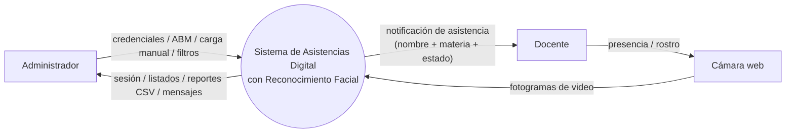
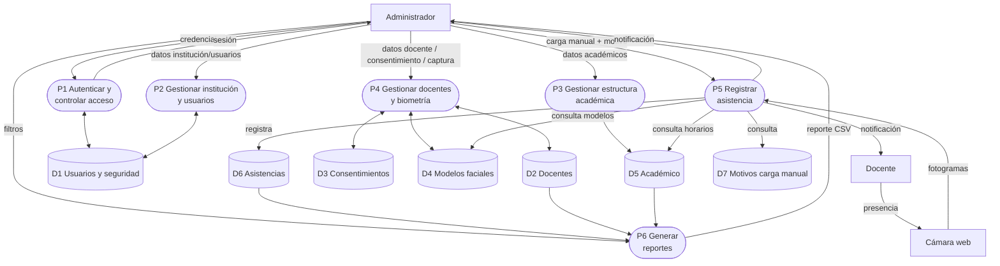
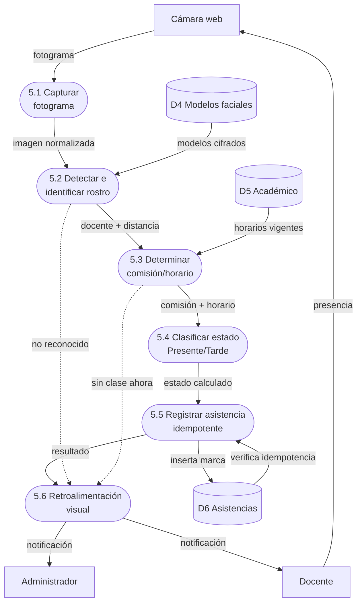

# Diagramas de Flujo de Datos (DFD)

Sistema de Asistencias Digital con Reconocimiento Facial — CENT35.

Notación: **Gane-Sarson**.
- **Entidad externa** (quién interactúa desde afuera): rectángulo.
- **Proceso** (qué hace el sistema): rectángulo redondeado, numerado.
- **Almacén de datos** (dónde se guarda): cilindro `D1…Dn`.
- **Flujo de datos**: flecha etiquetada con el dato que viaja.

> Los diagramas Mermaid de abajo se renderizan en GitHub y, además,
> **draw.io los importa** vía `Extras → Insertar → Mermaid…` para dejarlos
> prolijos. Cada nivel incluye una **tabla de especificación** para
> reconstruirlo a mano si se prefiere control total del layout.
>
> Nota de alcance: el módulo de **Auditoría** existe en el modelo de datos
> pero su escritura no está implementada en esta primera entrega, por lo
> que **no figura como proceso** en estos DFD (ver Documento de Alcance).

---

## Nivel 0 — Diagrama de Contexto ("la caja negra")

El sistema entero como un solo proceso. Solo se ven los actores externos y
qué entra / qué sale. Sin procesos internos ni almacenes.

### Especificación

**Entidades externas:**
| Cód | Entidad | Rol |
|---|---|---|
| EE1 | Administrador | Roles INSTITUCION / ADMIN. Opera el sistema. |
| EE2 | Docente | Sujeto pasivo: se posiciona frente a la cámara. |
| EE3 | Cámara web | Dispositivo que capta los fotogramas. |

**Flujos de entrada (hacia el sistema):**
| Origen | Dato que entra |
|---|---|
| Administrador | Credenciales de acceso |
| Administrador | Datos de gestión (ABM docentes, académico, usuarios) |
| Administrador | Consentimiento biométrico (carga en representación) |
| Administrador | Datos de carga manual / justificación de ausencia |
| Administrador | Filtros de reporte |
| Cámara web | Fotogramas de video |
| Docente | Presencia / rostro (a través de la cámara) |

**Flujos de salida (desde el sistema):**
| Destino | Dato que sale |
|---|---|
| Administrador | Confirmación de sesión y panel de inicio |
| Administrador | Listados, fichas y mensajes de resultado |
| Administrador | Reportes (CSV) |
| Administrador / Docente | Notificación de asistencia (nombre + materia + estado) |

### Mermaid

---

## Nivel 1 — Procesos principales ("abro la caja")

Los grandes módulos del sistema conectados entre sí, con los actores y con
los almacenes de datos. Todavía sin el detalle interno de cada proceso.

### Especificación

**Procesos:**
| Cód | Proceso |
|---|---|
| P1 | Autenticar y controlar acceso |
| P2 | Gestionar institución y usuarios |
| P3 | Gestionar estructura académica (carreras, materias, comisiones, horarios) |
| P4 | Gestionar docentes y biometría (consentimiento + modelo facial) |
| P5 | Registrar asistencia (automática y manual) |
| P6 | Generar reportes |

**Almacenes de datos:**
| Cód | Almacén | Tablas que agrupa |
|---|---|---|
| D1 | Usuarios y seguridad | instituciones, usuarios, roles |
| D2 | Docentes | docentes |
| D3 | Consentimientos | consentimientos_biometricos |
| D4 | Modelos faciales | modelos_faciales |
| D5 | Académico | carreras, materias, comisiones, horarios |
| D6 | Asistencias | asistencias, asistencias_manuales, justificaciones_ausencia |
| D7 | Motivos de carga manual | motivos_carga_manual |

**Flujos principales:**
| Desde | Hacia | Dato |
|---|---|---|
| Administrador | P1 | credenciales |
| P1 | D1 | valida usuario |
| P1 | Administrador | sesión / acceso |
| Administrador | P2 | datos de institución y usuarios |
| P2 | D1 | lee / escribe |
| Administrador | P3 | datos académicos |
| P3 | D5 | lee / escribe |
| Administrador | P4 | datos docente + consentimiento + captura facial |
| P4 | D2 / D3 / D4 | lee / escribe |
| Cámara web | P5 | fotogramas |
| P5 | D4 | consulta modelos (identificar) |
| P5 | D5 | consulta horarios (determinar comisión) |
| P5 | D6 | registra asistencia |
| Administrador | P5 | carga manual + motivo |
| P5 | D7 | consulta motivos |
| P5 | Administrador / Docente | notificación de asistencia |
| Administrador | P6 | filtros de reporte |
| P6 | D6 / D2 / D5 | consulta datos |
| P6 | Administrador | reporte CSV |

### Mermaid

---

## Nivel 2 — Explosión de P5 "Registrar asistencia automática"

Paso a paso interno del proceso P5 (camino automático por reconocimiento
facial). Es el flujo principal del sistema (RF-15 a RF-21).

### Especificación

**Subprocesos:**
| Cód | Subproceso |
|---|---|
| 5.1 | Capturar fotograma de la cámara |
| 5.2 | Detectar e identificar rostro |
| 5.3 | Determinar comisión / horario vigente |
| 5.4 | Clasificar estado (Presente / Tarde) |
| 5.5 | Registrar asistencia (idempotente) |
| 5.6 | Generar retroalimentación visual |

**Flujo principal:**
| Desde | Hacia | Dato |
|---|---|---|
| Cámara web | 5.1 | fotograma crudo |
| 5.1 | 5.2 | imagen normalizada |
| D4 Modelos faciales | 5.2 | modelos cifrados para comparar |
| 5.2 | 5.3 | docente identificado (+ distancia) |
| D5 Académico | 5.3 | horarios vigentes del docente |
| 5.3 | 5.4 | comisión + horario en curso |
| 5.4 | 5.5 | estado calculado (PRESENTE / TARDE) |
| 5.5 | D6 Asistencias | inserta marca (si no existe) |
| D6 Asistencias | 5.5 | verificación de idempotencia |
| 5.5 | 5.6 | resultado del registro |
| 5.6 | Administrador / Docente | notificación en pantalla |

**Flujos alternativos / excepciones:**
| Condición | Resultado |
|---|---|
| 5.2 no identifica rostro bajo el umbral | 5.6 muestra "Rostro no reconocido" (habilita carga manual) |
| 5.3 no encuentra horario en curso | 5.6 muestra "No hay clase en este momento" |
| 5.5 detecta marca ya existente | 5.6 muestra "Ya estaba marcado" (no duplica) |

### Mermaid

---

## Cómo exportar a imagen

### Opción A — GitHub / VS Code (rápido)
GitHub renderiza el Mermaid automáticamente al ver este `.md`. Para PNG:
captura de pantalla, o la extensión "Markdown Preview Mermaid Support" en
VS Code → click derecho sobre el diagrama → guardar imagen.

### Opción B — draw.io (entrega prolija)
1. Abrir [app.diagrams.net](https://app.diagrams.net) (draw.io).
2. `Extras → Insertar → Mermaid…` (o `Arrange → Insert → Advanced → Mermaid`).
3. Pegar el bloque Mermaid de cada nivel → "Insertar".
4. draw.io lo dibuja como figuras editables; reacomodar y, si se quiere,
   cambiar las formas a la notación Gane-Sarson exacta usando la tabla de
   especificación de cada nivel.
5. `Archivo → Exportar como → PNG / PDF`.

### Opción C — mermaid.live
Pegar en [mermaid.live](https://mermaid.live) → "Actions" → "PNG" / "SVG".
