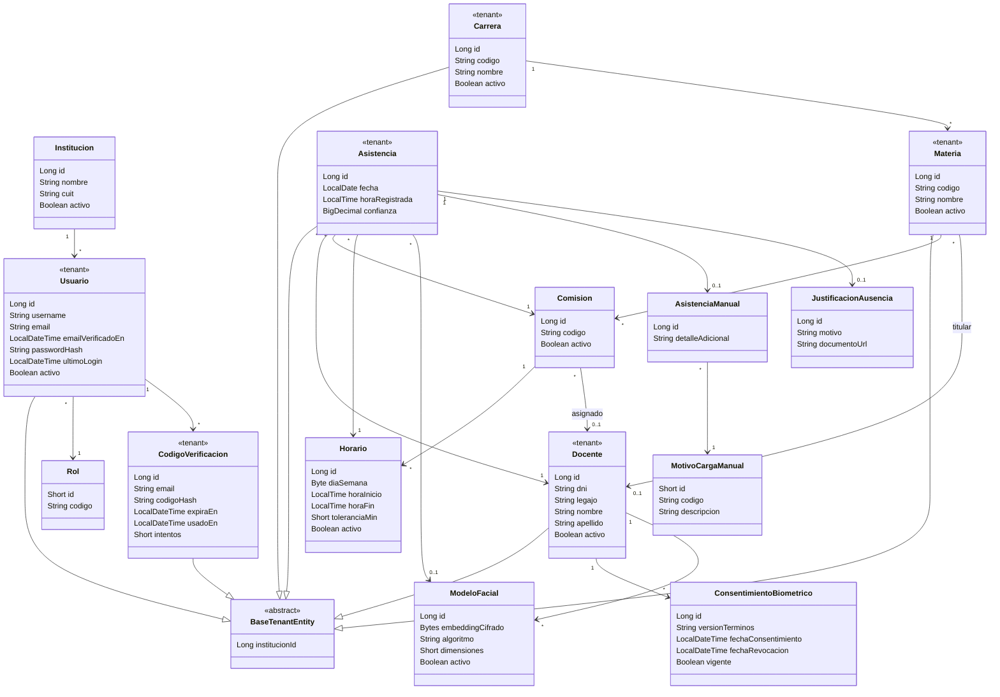
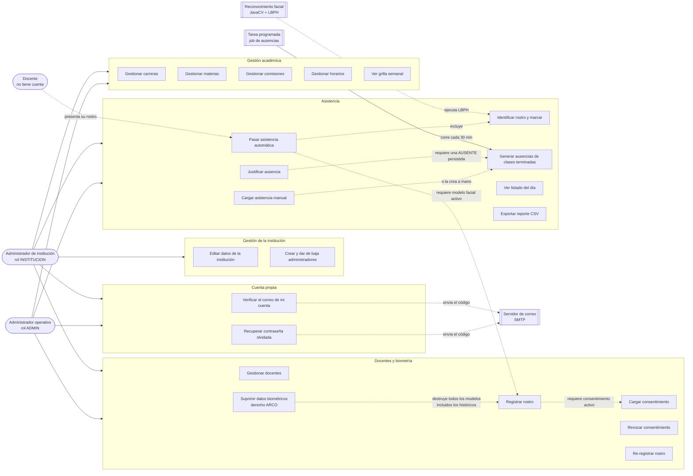
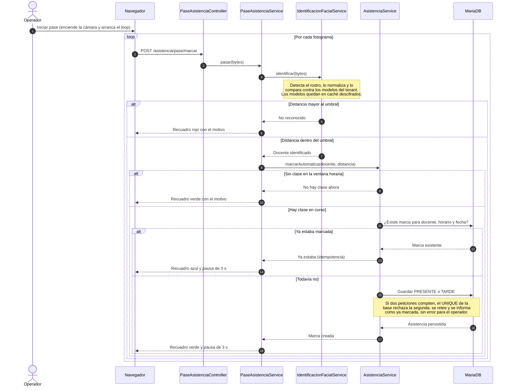

# Diagramas del sistema

Diagramas del sistema en **Mermaid**, que GitHub renderiza al abrir este archivo. No hace falta instalar nada ni exportar imágenes: se ven acá mismo, y VS Code también los dibuja en su vista previa de Markdown.

Esta es la **única fuente** de los diagramas. Antes convivían con una versión en PlantUML que había que renderizar aparte; se eliminó porque tener dos descripciones del mismo modelo garantiza que tarde o temprano digan cosas distintas.

El **diagrama de flujo de datos** vive aparte, en [dfd.md](./dfd.md), y también está en Mermaid.

---

## 1. Clases del dominio

Entidades JPA con sus relaciones. Las marcadas como `tenant` extienden `BaseTenantEntity`, es decir que llevan columna `institucion_id` y quedan alcanzadas por el filtro de Hibernate.

**Invariantes que no se ven en el diagrama:**

- `UNIQUE (docente_id, horario_id, fecha)` sobre `asistencias` es lo que garantiza la idempotencia del pase: si el docente se queda frente a la cámara, la marca no se duplica.
- **`AUSENTE` es híbrido.** El listado la calcula al vuelo para cubrir la ventana entre el fin de la clase y la próxima corrida del job, y después el job la persiste de verdad (`metodo=AUTOMATICO`, `hora=hora_fin`). **Solo la persistida se puede justificar**, porque una fila calculada no existe todavía en la base.
- `Comision` y `Horario` **no** son tenant-scoped: su institución se deduce de la materia padre, por eso sus consultas van por JOIN.
- El código de verificación se guarda **hasheado**; `codigoHash` nunca contiene el valor que viajó por correo.

---

## 2. Casos de uso

Mermaid no tiene diagrama de casos de uso, así que se representa como grafo: los actores a la izquierda y los casos agrupados por dominio.

**Lo que conviene señalar al presentarlo:**

- El **docente es sujeto pasivo**: no tiene cuenta ni inicia sesión. Aparece porque presenta su rostro, no porque opere el sistema. Por eso tampoco se le verifica el correo.
- Solo el rol INSTITUCION accede a la gestión de la institución y de los usuarios; todo lo demás lo comparten los dos roles.
- Hay **tres actores que no son personas**: el motor de reconocimiento, el job que genera las ausencias cada 30 minutos y el servidor de correo. Reconocerlos como actores es lo que deja ver que el sistema hace cosas sin que nadie las pida.
- Para **justificar** una ausencia hace falta que exista como fila persistida, y a eso se llega por dos caminos: la genera el job, o la carga un administrador a mano.

---

## 3. Pase de asistencia automático

Del fotograma que toma la cámara hasta la marca en la base.

**El detalle que más se pregunta:** cuando hay más de un horario dentro de la ventana —clases consecutivas, o el mismo docente en dos comisiones a la misma hora— el sistema no elige al azar. Aplica tres criterios en orden: prefiere los horarios sin marca previa, después el de hora de inicio más cercana, y ante empate exacto el de menor id, para que la decisión sea reproducible (RF-18, ADR-0008).
